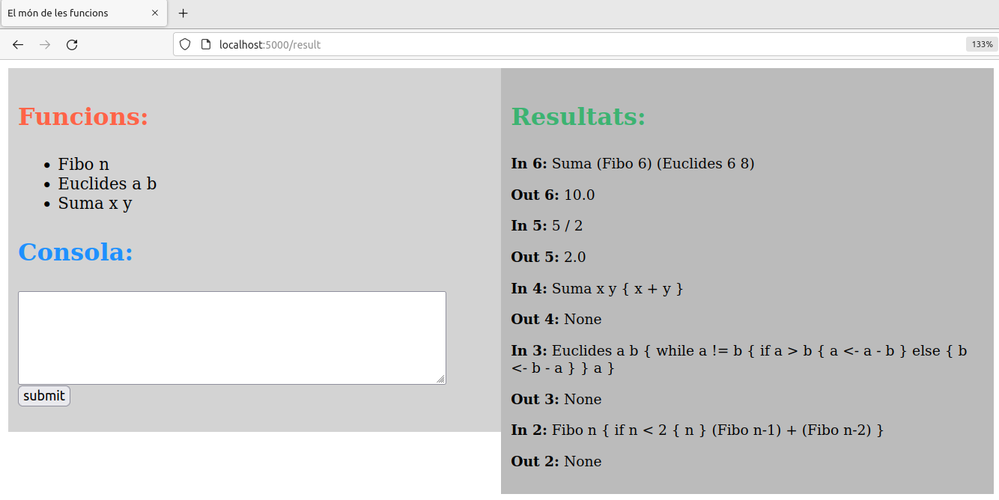

# L'intèrpret de funcions Funx

Aquesta pàgina descriu la pràctica de GEI-LP (edició 2022-2023 Q1). La vostra 
tasca és implementar un intèrpret per a un llenguatge de programació basat en 
expressions i funcions. L'entrada i la sortida d'aquest intèrpret serà 
mitjançant una plana web.

## Presentació del llenguatge

Funx és un llenguatge de programació orientat a expressions i funcions. Amb 
Funx podem definir funcions i acabar, opcionalment, amb una expressió.

A l'exemple següent es mostra una expressió final:

```
# expressions:

3 + 4 * 2
```

```
Out: 11
```

Com podeu veure, no es defineix cap funció i els comentaris es troben després
del símbol `#`. La sortida de l'intèrpret és el resultat de l'avaluació de 
l'expressió.

En Funx no podem definir programes, només funcions i una expressió final. Podem 
definir la llista de funcions sense que importi l'ordre.

Cada funció té un nom, paràmetres i un bloc associat. Els blocs es troben 
inscrits entre els símbols `{` i `}`.

Les funcions han de començar per una lletra majúscula. Les variables, en canvi, 
comencen amb una lletra minúscula.

Les funcions passen els paràmetres per còpia. Retornen el valor de qualsevol 
expressió que trobin en el seu bloc i en aquell precís instant. A continuació 
en teniu un exemple:

```
# funció que rep dos nombres enters i en torna la seva suma
Suma x y
{
  x + y
}

Suma (2 * 3) 4 
```

```
Out: 10
```

Això implica que si trobem més d'una expressió en una funció, tindrem més d'un punt de 
sortida de la funció. 

Com no podia ser d'altra manera, el llenguatge de programació Funx compta amb 
recursivitat. 

Mireu l'exemple següent:

```
Fibo n
{
    if n < 2 { n }
    (Fibo n-1) + (Fibo n-2)
}

Fibo 4
```

```
Out: 3
```

Les variables són locals a cada invocació de cada funció i les funcions es 
poden comunicar a través de paràmetres. Les funcions llisten els noms dels seus
paràmetres formals, però no inclouen els seus tipus. Els paràmetres es separen
amb blancs, com en Haskell.

Mireu l'exemple següent:

```
# funció que rep dos enters i en torna el seu maxim comu divisor

Euclides a b
{
  while a != b
  {
    if a > b 
    {
      a <- a - b
    }
    else
    {
      b <- b - a
    }
  }
  a
}

Euclides 6 8
```

```
Out: 2
```

Les variables no han de ser declarades, totes seran de tipus enter. No 
existeixen operacions de lectura ni d'escriptura.

L'operador de comparació per igualtat és `=` i per diferència és `!=`. 
L'assignació es fa amb la instrucció `<-`.

Les funcions poden no tenir paràmetres. 
Podem definir d'aquesta forma funcions constants:

Exemple:
  
```
DOS { 2 }
Suma2 x { DOS + x }
Suma2 3
```

```
Out: 5
``` 

Si una funció no té cap expressió no tornarà res.

# Especificació de Funx

Les instruccions de Funx són:

- l'assignació amb `<-`,
- la invocació de funcions,
- el condicional amb `if` i potser `else`,
- la iteració amb `while`,

Les instruccions escrites una rera l'altra s'executen seqüencialment.

## Assignació

L'assignació ha d'avaluar primer l'expressió a la part dreta del `<-` i 
emmagatzemar després el resultat a la variable local a la part esquerra. 

Exemple: `a <- a - b`. 

Fixeu-vos en que l'assignació no retorna res. 

## Condicional

La instrucció condicional té la semàntica habitual. El bloc del sinó és optatiu.

Exemples: `if x = y { z <- 1 }` i `if x = y { z <- 1 } else { z <- 2 }`. 

Fixeu-vos que els limitadors dels blocs sempre són obligatoris (tant als 
condicionals com als procediments i als `while`s).

## Iteració amb `while`

La instrucció iterativa amb `while` té la semàntica habitual. 

Exemple: `while a > 0 { a <- a / 2 }`.

## Invocació de funció

La crida a una funció té la semàntica habitual.
Si el nombre de paràmetres passats no corresponen als declarats, es produeix un 
error. Les funcions es poden cridar recursivament. La sintàxi és sense parèntesis ni comes.

Exemple: `Suma x + y 2`.

## Expressions

Si una variable encara no ha rebut cap valor, el seu valor és zero. Els
operadors aritmètics són els habituals (`+`, `-`, `*`, `/`, `%`) i amb la
mateixa prioritat que en C. Evidentment, es poden usar parèntesis. Tots els
operadors aritmètics són d'enters, inclosa la divisió. 

El operadors relacionals (`=`, `!=`, `<`, `>`, `<=`, `>=`) retornen zero per fals i u per
cert.

## Àmbit de visibilitat

No importa l'ordre de declaració de les funcions. Les variables són locals a
cada invocació de cada procediment. No hi ha variables globals ni manera
d'accedir a variables d'altres procediments (només a través dels paràmetres).

## Errors

Malgrat que Funx és força senzill, les funcions poden causar molts errors en 
temps d'execució. Per aquesta pràctica, només us demanem que detecteu els 
errors més verosímils (divisió per zero, crida a funció no definida, repetició 
de funció ja definida, nombre de paràmetres incorrectes, noms de paràmetres 
formals repetits...) i que l'intèrpret llanci amb una excepció quan es donen. 

# L'intèrpret

L'intèrpret ha d'anar processant les entrades en format Funx i guardar en una
estructura de dades interna les funcions que es vagin definint.

La seva part visual ha de tenir almenys 3 zones:

- Consola: permetrà a l'usuari introduïr l'entrada en format Funx.

- Resultats: mostrarà les 5 últimes entrades i els seus resultats respectius.

- Funcions: una llista de les funcions que s'han definit previament amb els 
seus paràmetres.

A la figura següent en teniu un exemple:



Per tal d'aconseguir aquest resultat heu d'utilitzar la llibreria `flask` i els
*templates* de `jinja`.

## Llibreries

Utilitzeu `ANTLR` per escriure la gramàtica i l'intèrpret, i `flask` per al servidor 
web. Podeu utilitzar lliurament qualsevol llibreria estàndard de Python.

Podeu instal·lar el flask i jinja2 a Linux amb les comandes:

```bash
pip install flask
pip install Jinja2
```

## Invocació de l'intèrpret


El vostre intèrpret s'ha d'invocar amb les comandes:

```bash
export FLASK_APP=funx
flask run
```

On el `funx` de la primera comanda correspon al vostre script principal.

## Extensions

Podeu extendre el llenguatge amb construccions del vostre gust, a condició de 
mantenir una compatibilitat estricta amb l'especificació donada. A més, cal que 
documenteu amb precisió les vostres extensions i que creeu programes que les 
provin i posin de manifest la seva utilitat.

Per exemple, podríeu extendre Funx amb funcions d'ordre superior, millora de la
part visual, operadors lògics... 

Compte: Les extensions poden portar molta feina, consulteu-les abans amb el 
vostre professor.


# La vostra feina

La vostra feina consisteix en implementar un intèrpret de Funx amb ANTLR. La
interacció amb l'usuari s'ha de produïr mitjançant la llibreria python `flask` i
les *templates* html de `jinja2`.

# Consells

Per tal de fer la  pràctica, us recomanem de seguir aquests passos:

1. Feu tots els exercicis de laboratori inclosos a 
https://gebakx.github.io/Python3/compiladors.html#1. Us serà molt útil, de debò.

1. Escriviu els visitadors per la gramàtica per obtenir una primera versió de 
l'intèrpret que funcioni sense `flask`.

1. Genereu l'entorn *localhost* amb `flask` i `jinja`.

1. Escriviu el README.

1. Si voleu, realitzeu extensions.

Al llarg de tots els passos anteriors, aneu documentant tot allò que no sigui 
obvi.

Deixeu la feina bruta a l'ANTLR: si feu una bona gramàtica, cadascun dels 
vostres visitadors serà molt curt i molt senzill. Si els vostres visitadors 
tenen molta lògica, retoqueu la gramàtica, introduint noves regles i/o 
etiquetes.

Feu la pràctica "amb carinyo".

# Lliurament

Heu de lliurar la vostra pràctica al Racó. Només heu de lliurar un fitxer ZIP
que, al descomprimir-se generi:

- Un fitxer `README.md` que documenti el vostre projecte.
|:- vegeu, per exemple, https://www.makeareadme.com/.

- Un fitxer `funx.g4` amb la gramàtica del LP.

- Un fitxer `funx.py` amb el programa de l'intèrpret, incloent els seus 
visitadors.

- Un fitxer `base.html` en una carpeta `templates` amb la plantilla `jinja` de la 
vostra pràctica.

- Si heu fet extensions, podeu afegir fitxers `test-*.funx` com a exemples i 
jocs de proves.

- Res més. De debò, res més. Tampoc directoris. Ni subdirectoris. Ni `.git`s, 
ni `.MACOS_XXX`... Res més!

Els vostres fitxers de codi en Python han de seguir les regles d’estı́l PEP8, 
tot i que podeu oblidar les restriccions sobre la llargada màxima de les 
lı́nies. Podeu utilitzar els paquets `pep8` o `autopep8` o 
http://pep8online.com/ per assegurar-vos que seguiu aquestes regles d’estı́l. 
L’ús de tabuladors en el codi queda prohibit (zero directe). Els vostres 
programes en Funx han de seguir l'estil exposat en aquest document.

El termini de lliurament és el **dilluns 16 de gener a les 8:00**.

Per evitar problemes de còpies,
no pengeu el vostre projecte en repositoris públics.


# Referències

- ANTLR en Python: https://gebakx.github.io/Python3/compiladors.html#1

- flask: https://flask.palletsprojects.com/en/2.1.x/quickstart/#a-minimal-application

- jinja: https://jinja.palletsprojects.com/en/3.1.x/

- Exemple 1: https://pythonbasics.org/flask-template-data/

- Exemple 2: https://code.tutsplus.com/tutorials/templating-with-jinja2-in-flask-essentials--cms-25571
